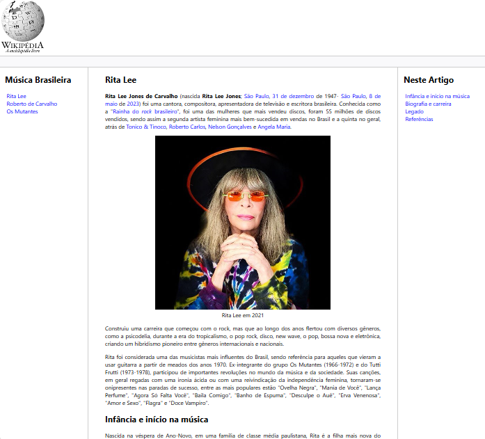

# Trilha HTML - Módulo 3  

Projeto desenvolvido no **Bootcamp Santander 2025 - Front End (DIO)**.  
O desafio consistiu em **reproduzir uma página moderna da Wikipedia**, aplicando conceitos aprendidos em **HTML semântico** e boas práticas de marcação.  

---

## Tema Escolhido  
A página foi dedicada à **história e legado de Rita Lee**, ícone da música brasileira, trazendo uma apresentação moderna do conteúdo.  

---
## Preview do Projeto


## Deploy Online  
👉 [Acesse aqui](https://trilha-html-desafio-02-wiki-rita-le.vercel.app/)  

---

## Tecnologias Utilizadas  
- **HTML5** (com foco em semântica e estrutura)  
- **CSS3** (para estilização da página)  

---

## Estrutura do Repositório  
- `index.html` → Estrutura principal da página  
- `assets/css/style.css` → Estilização com CSS  
- `assets/images/` → Imagens utilizadas no projeto  

---

## 🔧 Como Executar Localmente  
1. Clone este repositório:  
   ```bash
   git clone https://github.com/stephanie-lops/trilha-HTML-desafio-02-wiki-rita-lee.git

2. Acesse a pasta do projeto:
   ```bash
   cd trilha-HTML-desafio-02-wiki-rita-lee

3. Abra o arquivo index.html no navegador de sua preferência

## Créditos

- Projeto desenvolvido no Bootcamp Santander 2025 - Front End (DIO)
- Autora: Stephanie Lopes
